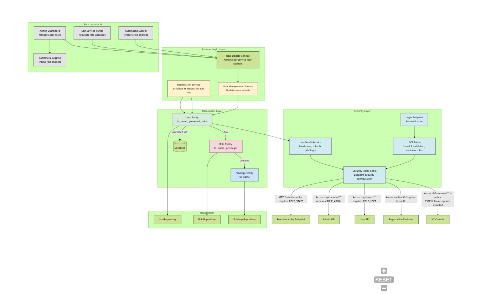
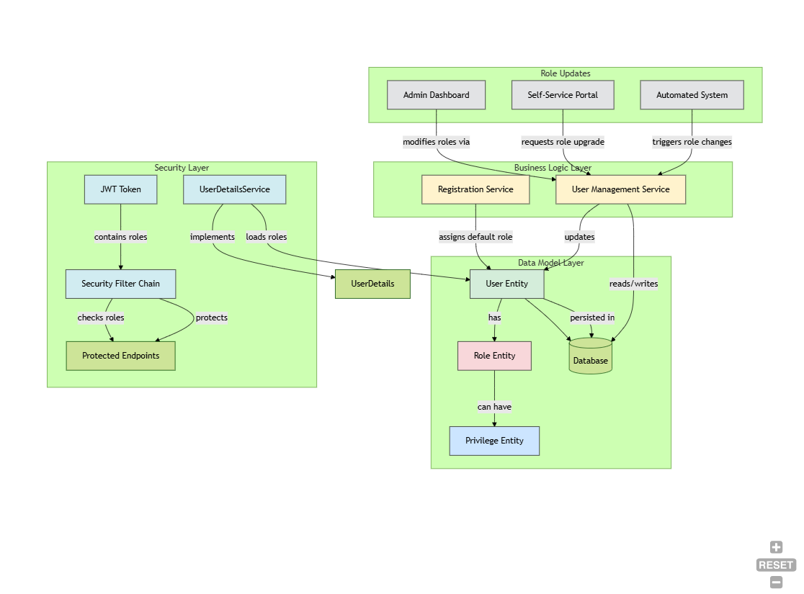

# Project Documentation

## Overview
This project is a Spring Boot application that manages roles and privileges. It includes user registration, authentication, and role-based access control.

## Prerequisites
- Java 17 or higher
- Maven 3.6.0 or higher
- An IDE such as IntelliJ IDEA

## Project Structure
- `src/main/java/com/mongs/roles`: Contains the main application code.
- `src/main/resources`: Contains configuration files such as `application.yml`.
- `src/test/java/com/mongs/roles`: Contains test cases.

## Getting Started

### Cloning the Repository
To get started, clone the repository using the following command:
```sh
git clone https://github.com/Dancan254/RolesandPrivileges
cd RolesandPrivileges
```

### Building the Project
Navigate to the project directory and build the project using Maven:
```sh
mvn clean install
```

### Running the Application
You can run the application using the following command:
```sh
mvn spring-boot:run
```

Alternatively, you can run the `RolesAndPrivilegesApplication` class from your IDE.

### Accessing the H2 Console
The H2 console is enabled and can be accessed at:
```
http://localhost:8080/h2-console
```
Use the following credentials to log in:
- **JDBC URL**: `jdbc:h2:mem:testdb`
- **Username**: `sa`
- **Password**: `password`

### API Endpoints
The application exposes several API endpoints:

- **User Registration**: `POST /api/auth/register`
- **Role Hierarchy**: `GET /roleHierarchy` (Requires `STAFF` role)
- **Admin Endpoints**: `/api/admin/**` (Requires `ADMIN` role)
- **User Endpoints**: `/api/user/**` (Requires `USER` role)

### Security Configuration
The security configuration is defined in the `SecurityConfig` class. It includes role-based access control and disables CSRF protection for stateless session management.

### Role Hierarchy
The role hierarchy is defined as:
- `ROLE_ADMIN` > `ROLE_STAFF`
- `ROLE_STAFF` > `ROLE_USER`

## Configuration
The application configuration is defined in the `application.yml` file. Key configurations include:
- **DataSource**: Configured to use an in-memory H2 database.
- **JPA**: Hibernate is configured to update the database schema automatically.

## Example Usage

### Register a New User
To register a new user, send a `POST` request to `/api/auth/register` with the following JSON payload:
```json
{
  "firstName": "John",
  "lastName": "Doe",
  "email": "john.doe@example.com",
  "password": "password123"
}
```

### Accessing Protected Endpoints
Ensure you have the appropriate role to access protected endpoints. For example, to access `/api/admin/**`, you need to have the `ADMIN` role.

## Flowchart


